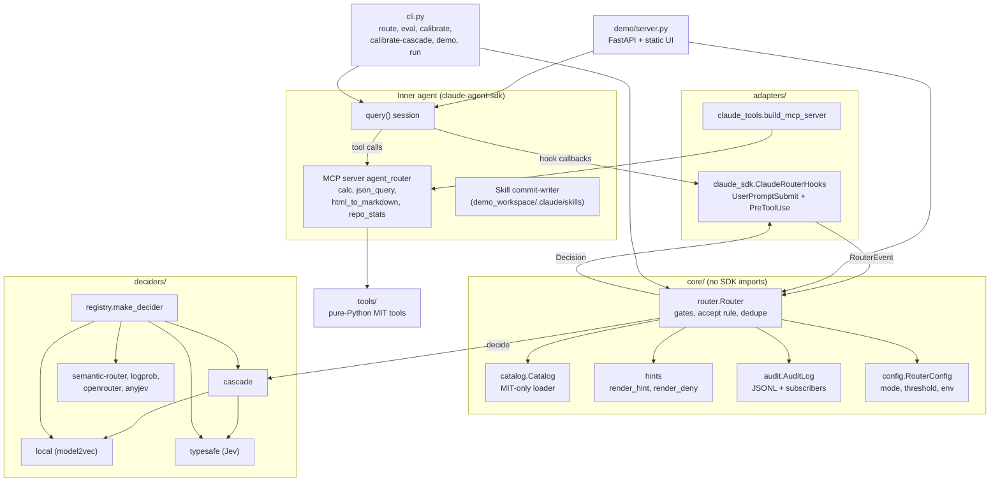
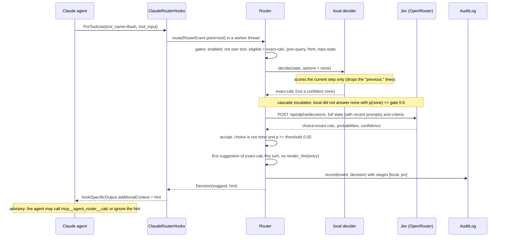

# Architecture

`core/` holds the router, catalog, hint templates, audit log and config. It must not import a host
SDK. Adapters translate host events into `RouterEvent` and turn a `Decision` back into hook output.
Deciders all implement the same Jev `choice` contract:

```
decide(state: str, options: {id: OptionSpec(what, not_for, examples)}) -> ChoiceResult
ChoiceResult = {choice, probabilities (sum 1), confidence 0..1, backend, latency_ms, stages}
```

## Components



## One PreToolUse decision through the cascade

The agent is about to run `Bash` with `python3 -c "print(2**200)"` during the turn whose prompt was
"compute 2**200 exactly".



**Where this can end differently:**

- **Enforce mode, tool point.** The hook returns `permissionDecision: "deny"` with the
  `render_deny` text instead of a hint.
- **Jev errors or times out (2 s).** The cascade returns the local answer and moves a non-`none`
  choice below p=0.95 to `none`. The backend is recorded as `cascade:local-fallback`.
  After 3 consecutive Jev failures, a circuit breaker skips Jev for 60 s. Those stages are marked
  `skipped: "circuit-open"`.
- **Both stages fail.** The router fails open: the decision is `native` and the hook returns `{}`.

## Router rules (`core/router.py`)

The same nine rules, in the same order, as the `core/router.py` docstring:

1. Routing is disabled, or the hook point is not enabled: `skipped`.
2. The pending call targets `mcp__agent_router__*` or a catalog target (loop guard): `skipped`.
3. No catalog entry lists this point, or at tool/skill points this tool in `replaces`: `skipped`.
4. Build the decider state: prompt text, the pending call as compact JSON (tool/skill points), and
   up to three recent prompts as `previous: ...` lines. The local classifiers drop those lines and
   score the current step only; Jev gets the whole state.
5. Ask the decider. If it raises: `native` (fail open).
6. The choice is not one of the offered options: `native`, recorded as `none` (the unknown text is
   never repeated).
7. The choice is `none`, or p(choice) < threshold: `native`.
8. Enforce mode at the tool point: `enforce` (deny) on every matching call.
9. The entry was already suggested this (session, turn): `skipped`. Otherwise: `suggest`.

## Audit record (`core/audit.py`)

The log is append-only JSONL with one object per `Router.route` call, including skipped calls.
Writes are locked and fail open.

| Field | Type | Notes |
|---|---|---|
| `ts` | ISO-8601 UTC | |
| `session`, `turn` | str, int | the adapter bumps `turn` on each `UserPromptSubmit` |
| `point`, `tool_name`, `agent_type` | str, str or null, str or null | `prompt` / `tool` / `skill`; `agent_type` is the host-reported subagent (null on the main thread) |
| `tool_use_id`, `agent_id` | str or null | the host's ids for the pending call and for the subagent run making it; they join a decision to what the call did (the command itself is only hashed, in `state_sha256`) |
| `state_sha256` | hex | hash of the full decider state (prompt, pending call, recent prompts) |
| `text` | str | prompt text, first 300 characters |
| `options` | list[str] | the offered ids, `none` last; empty when a gate stopped the call before the decider |
| `probabilities`, `choice`, `confidence` | dict, str, float | the decider's answer; `{}` / null when not asked |
| `action`, `reason`, `entry_id` | str | `suggest` / `enforce` / `native` / `skipped`; `reason` never reaches the agent |
| `hint` | str or null | templated text, first 300 characters (Replay re-renders the full hint) |
| `backend`, `latency_ms` | str, float | e.g. `local`, `jev:typesafe/jev-1.13-20260917` (the served model), `cascade:local`, `cascade:jev:…`, `cascade:local-fallback` |
| `stages` | list[dict] | cascade only: one entry per stage (`role`, `backend`, `choice`, `probabilities`, `confidence`, `latency_ms`, `failed`, `error_type`, `error`, `skipped`); `failed` is a bool, `error_type` the exception class name, `skipped` e.g. `"circuit-open"`; `error` (exception text) is truncated and kept out of the timeline and UI |
| `catalog_version`, `thresholds` | str, dict | `{threshold, mode}` in effect |

**Where the log goes and who reads it:**

- **Default location.** The demo writes to `.agent-router/audit/<session>.jsonl`. `agent-router run`
  and `route` write to `AGENT_ROUTER_AUDIT` if set, otherwise they keep records in memory.
- **Replay** lists the demo's `.agent-router/audit/` sessions and the bundled `audit/sample-session.jsonl`.
- **Trace** reads decision traces (`<session>.jsonl`) from `--trace-dir`, by default the `trace/`
  folder next to the audit folder, where an integration's record-only hooks write them
  (`integrations/first-principles/trace.py`). It interleaves the router's notes from the audit log
  of the same session.
- **Live agent timeline.** The adapter's `decision` event carries the same fields, minus `reason`.
  Its schema is in the `adapters/claude_sdk.py` docstring.
