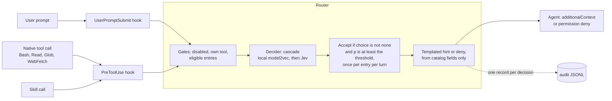

# Technical guide

The technical reference for agent-router: how the router works, the decision backends and their measured
accuracy, the catalog, hook points and modes, configuration, security, and other hosts. For the plain-language
overview and the demo walkthrough, see the [README](../README.md).

Related docs: [architecture.md](architecture.md) (components, sequence diagram, audit schema),
[adapters.md](adapters.md) (Codex CLI and Gemini CLI), [research.md](research.md) (literature, Jev, Tenjin).

## Contents

[How it works](#how-it-works) ·
[Command line](#quick-start) ·
[Backends and results](#backends-and-results) ·
[Catalog](#catalog) ·
[Hook points and modes](#hook-points-and-modes) ·
[Configuration](#configuration) ·
[Security notes](#security-notes) ·
[Other hosts](#adapting-to-codex-cli-and-gemini-cli) ·
[Research](#research) ·
[License](#license)

## How it works



1. The adapter (`adapters/claude_sdk.py`) converts each hook call into a `RouterEvent`: the hook point,
   the prompt text, the pending tool name and input, and up to three recent prompts. The local
   classifiers score only the current step; Jev also sees the recent prompts.
2. `Router.route` (`core/router.py`) applies its gates in this order. It skips the step when routing is
   disabled. It skips calls to the router's own tools and to catalog targets (loop guard). It skips when
   no catalog entry is eligible for this point and tool. An entry can name a fit check (`fits:`, from
   the fixed list in `core/fit.py`) that asks whether the entry could actually run the pending call.
   For example, `calc_expression` passes only one arithmetic expression the calculator evaluates.
   An entry that fails its check is dropped before the decider, so it does not use up its one hint
   for the turn.
3. The decider answers a Jev `choice` question over the eligible entries plus `none`. It returns a
   choice, a probability for each option, and a confidence.
4. `none`, or a probability below the threshold, means the agent carries on unchanged. Otherwise the
   router builds a hint from a fixed template over catalog fields. Each entry is suggested at most once
   per turn.
5. Each decision writes one audit record to JSONL.

### The classifier can only point, never write

The decision model picks from a list; nothing it produces reaches the agent as text. Four parts of
the code enforce this, and tests cover each one:

- **Enum output.** The only answers are catalog ids and `none`. If a backend returns anything else,
  the router treats it as `none`, records it as `none` (audit and timeline), and never repeats that
  text. The playground shows a decider error as its exception type only.
- **Templated hints.** `core/hints.py` builds hint and deny text only from catalog fields (name,
  project, `what`, target). `Decision.reason` can hold exception text, so it stays in the audit log
  and the adapter never passes it to the agent.
- **Loop guard.** Calls to `mcp__agent_router__*` or to a catalog skill are never routed, and each
  entry is suggested at most once per (session, turn).
- **Fail open.** If a decider raises an error or times out, the step is `native` and the hook
  returns `{}`. A broken backend cannot block the agent. Audit write failures are logged and
  swallowed.

## Quick start

Requires Python 3.11+ and [uv](https://docs.astral.sh/uv/).

```bash
git clone https://github.com/usathyan/agent-router && cd agent-router
make install          # uv venv .venv, then uv pip install -e ".[dev]"
make test             # offline unit tests, about 5 s
make run              # demo on http://127.0.0.1:8765
```

- **Default backend.** With no API key, every command uses the offline `local` backend.
  `export OPENROUTER_API_KEY=sk-or-...` (or `TYPESAFE_API_KEY`) makes the cascade the default
  and enables `jev`.
- **`make route` and `make eval`** use `BACKEND=local` unless you pass another one.

```bash
make route Q="What is 17% of 2,340 exactly?"                  # offline
make route Q="What is 17% of 2,340 exactly?" BACKEND=cascade  # asks Jev if local is unsure
make eval                                                     # holdout accuracy / FPR, local
.venv/bin/agent-router route "compute 2**200" --point tool --tool Bash \
    --input '{"command": "python3 -c \"print(2**200)\""}' --json
```

Run the real agent. This needs a Claude Code login (or `ANTHROPIC_API_KEY`) and spends tokens; the
default model is `claude-haiku-4-5`:

```bash
.venv/bin/agent-router run "What is 2**200 exactly?" --workspace demo_workspace
```

`--workspace` is the agent's working directory (default: the current one); `demo_workspace/` holds
the sample files and the `commit-writer` skill.

The demo has four tabs:

- **Playground** routes one step with any backend and shows the probability bars. For the cascade it
  shows both stages.
- **Live agent** streams a real SDK run: hooks, decisions, tool calls and the answer.
- **Replay** steps through an audit session. `audit/sample-session.jsonl` is included.
- **Trace** shows an integration's decision trace for a session: a summary (conclusion, gate
  bands, delegation and calculator notes), a timeline of what the agent did with the router's notes
  placed where they fired, and the decisions parsed from its report. It reads `--trace-dir`
  (default: `trace/` next to `--audit-dir`). See `integrations/first-principles/README.md`.

| Live agent | Replay |
|---|---|
|  |  |

`make help` lists all targets:

| Target | What it does |
|---|---|
| `venv` | Creates the virtual environment |
| `install` | Installs the package and dev dependencies |
| `clean` | Removes build artifacts |
| `test` | Runs the unit tests offline |
| `test-model` | Runs the model2vec tests (downloads the model once) |
| `test-live` | Runs a real SDK session plus paid Jev/OpenRouter calls |
| `lint` | Checks the code |
| `format` | Formats the code |
| `eval` | Runs the evaluation |
| `calibrate` | Re-fits the local decider and rewrites `calibration.json` |
| `calibrate-cascade` | Paid: calls Jev once per cal case |
| `run` | Starts the demo server |
| `route` | Routes one step |

Extras are optional:

- `uv pip install -e ".[semantic-router]"` adds the `semantic-router` backend.
- `".[llm]"` adds the local Qwen3-0.6B `logprob` backend (builds llama.cpp).
- `".[anyjev]"` adds the Apache-2.0 plugin.

## Backends and results

Choose a backend with `--backend`. Without the flag, the default is `cascade` when a Jev key is set,
otherwise `local`.

| Backend | What it is | License | Needs |
|---|---|---|---|
| `cascade` (default with a key) | Runs `local` first. If `local` is confidently `none` (p(none) ≥ gate 0.6), that answer is final. Otherwise Jev is asked. If Jev fails, the cascade falls back to `local`, biased to `none`. After 3 Jev failures in a row it stops asking Jev for 60 s | MIT (our code) + Jev API | Jev key |
| `local` (default offline) | Our Jev-spec classifier: model2vec `potion-base-8M` embeddings against each entry's `what` / `examples` / `not_for`, softmax scores, calibrated on the cal split | MIT | nothing (model downloads once) |
| `jev` | TypeSafe Jev `~typesafe/jev-latest` through OpenRouter `POST /api/alpha/decisions`, or directly at `api.typesafe.ai/v1/systemone` | MIT client, proprietary model | `OPENROUTER_API_KEY` or `TYPESAFE_API_KEY` |
| `openrouter` | Letter-logprob readout ("Jev in 25 lines") from `qwen/qwen3.7-flash` over OpenRouter chat completions | MIT client | `OPENROUTER_API_KEY` |
| `logprob` | The same readout from a local Qwen3-0.6B GGUF through llama.cpp | MIT | extra `llm` |
| `semantic-router` | aurelio-labs semantic-router with a TF-IDF encoder | MIT | extra `semantic-router` |
| `anyjev` | [AnyJev](https://github.com/MorrisZJ/AnyJev) turns any causal LM into a Jev-style classifier. Our adapter is MIT; the plugin is not | **Apache-2.0**, opt-in | extra `anyjev` (torch) |

**Jev transport.** `jev` uses OpenRouter when `OPENROUTER_API_KEY` is set, otherwise TypeSafe
directly. A key passed in code picks OpenRouter when it starts with `sk-or-`.

**Cost and timeout.**

- A Jev decision costs about $0.000015. A holdout run costs about $0.001.
- At runtime the Jev request timeout is 2 s. The cascade row below was measured with that 2 s
  timeout (`agent-router eval --backend cascade --timeout 2`) and had no timeouts.
- If Jev times out, the cascade falls back to its local answer, biased to `none`. That keeps the
  false-positive rate low but can lose recall on a slow network.

### Measured on the holdout

`evals/eval_set.yaml` has 127 labelled cases: 63 for calibration and 64 held out (37 positive,
27 negative, including decoys). Ten of them are multi-turn "context" cases whose earlier prompts
point at a different entry (for example "run the tests again" after an HTML-conversion prompt).

- **Accuracy** is top-1 over the holdout cases.
- **FPR** is the share of holdout cases where the right answer is `none` but the backend suggested
  an entry anyway.

| Backend | Holdout | Accuracy | FPR | Notes |
|---|---|---|---|---|
| **cascade** (default with key) | 64 | **0.891** | **0.000** | 70.3% of steps escalated to Jev (45/64); 2 s timeout: mean 183 ms, p95 302 ms, max 403 ms; 0 fallbacks |
| local, model2vec (calibrated) | 64 | 0.797 | 0.148 | offline; mean 0.3 ms per step when warm (the first call loads the model) |
| jev | 59 | 0.949 | 0.000 | every step is a Jev call; mean 240 ms |
| openrouter (Qwen logprob) | 59 | 0.763 | 0.292 | 7 request errors (router failed open) |
| logprob (local Qwen3-0.6B) | 59 | 0.525 | 0.708 | leans towards suggesting |
| semantic-router (TF-IDF) | 59 | 0.458 | 0.250 | |
| local, hashing embedder (defaults) | 59 | 0.390 | 0.042 | conservative, low recall |

The cascade and local model2vec rows are from the current 64-case holdout. The other rows were
measured on the earlier 59-case holdout, before the context cases were added, and were not re-run.
The two Qwen rows come from a single controller run and have no saved raw output. The other rows are
reproducible:

```bash
agent-router eval --backend <name> [--embedder hashing] [--json]
```

**Where each backend goes wrong:**

- **cascade.** It misses 4 tool-point cases that Jev also misses (short `python3 -c`, `node -e`
  and `sed` one-liners). It also misses 3 positives that `local` answered as a confident `none`.
  That is the price of skipping 30% of Jev calls.
- **local.** Its errors are near-misses that static embeddings cannot separate: "edit package.json"
  versus "query JSON", and "review a diff" versus "write a commit message for a diff".
- **Conversation history.** The router passes the last three prompts along with each step. The
  local classifiers score only the current step (the `previous: ...` lines are dropped), so an
  earlier JSON request can no longer pull "run the test suite" towards `json-query`; the regenerated
  `audit/sample-session.jsonl` shows both former false positives staying native. Jev, the cascade's
  confirm stage, still gets the recent prompts as context. The eval set's context cases cover this:
  on them the cascade scored 5/5 on the holdout.

## Catalog

The decision model can only choose one of these entries or `none`. They are defined in
`src/agent_router/catalog.yaml` (version `2026-09-26.1`).

| id | kind | Target | Backed by (MIT) | Points | Replaces |
|---|---|---|---|---|---|
| `exact-calc` | tool | `mcp__agent_router__calc` | own code | prompt, tool | Bash |
| `json-query` | tool | `mcp__agent_router__json_query` | [jmespath.py](https://github.com/jmespath/jmespath.py) | prompt, tool | Bash, Read |
| `html-to-markdown` | tool | `mcp__agent_router__html_to_markdown` | [python-markdownify](https://github.com/matthewwithanm/python-markdownify) | prompt, tool | Read, Bash, WebFetch |
| `repo-stats` | tool | `mcp__agent_router__repo_stats` | own code | prompt, tool | Bash, Glob |
| `commit-writer` | skill | `commit-writer` | own skill (`demo_workspace/.claude/skills/`) | prompt, skill | Skill |

- **Where the tools run.** The four tools are served in process by the MCP server `agent_router`
  (`adapters/claude_tools.py`). They run offline.
- **MIT only.** `core/catalog.py` rejects any entry whose `license` is not `MIT`. It also rejects
  duplicate ids, the reserved id `none`, and missing fields.

**Adding an entry:**

1. **Implement the target.** A new tool goes in `src/agent_router/tools/` and is registered in
   `adapters/claude_tools.py`. A skill goes under `.claude/skills/<name>/SKILL.md` in the agent's
   workspace.
2. **Describe it in `catalog.yaml`:**
   - fields: `id`, `kind`, `name`, `project`, `license: MIT`, `url`, `target`, `points`, `replaces`
   - `what`: one sentence
   - `not_for`: the near-misses it must not match
   - `examples`: 5–8 real phrasings, including shell commands for the tool point
3. **Bump `version`.** Both calibration blocks are tied to the catalog version. Until you re-run
   `make calibrate` (offline) and `make calibrate-cascade` (paid), both deciders fall back to their
   uncalibrated defaults. They log a warning when this happens.
4. **Add eval cases** to `evals/eval_set.yaml` and run `make eval`. A test rejects eval cases that
   copy catalog examples.

## Hook points and modes

| Point | Claude SDK hook | Advisory (default) | Enforce (`--mode enforce` / `AGENT_ROUTER_MODE=enforce`) |
|---|---|---|---|
| prompt | `UserPromptSubmit` | `additionalContext` hint | hint (a prompt is never denied) |
| tool | `PreToolUse` (native tools) | `additionalContext` hint | `permissionDecision: deny` with the templated deny text, on every matching call |
| skill | `PreToolUse` with `tool_name="Skill"` | `additionalContext` hint | hint (enforce applies to the tool point only) |

A sample hint:

> [agent-router] An MIT-licensed alternative may fit this step: Exact calculator (agent-router (own code),
> MIT) — Exact arithmetic and math evaluation: … Call tool mcp__agent_router__calc. Optional: ignore it if
> your current approach is better.

## Configuration

| Variable | Effect |
|---|---|
| `AGENT_ROUTER_MODE` | `advisory` (default) or `enforce` |
| `AGENT_ROUTER_THRESHOLD` | Overrides the calibrated threshold (local 0.35, cascade/jev 0.50) |
| `AGENT_ROUTER_DISABLED` | `1` (or `true`, `yes`, `on`) turns routing off. Every step is skipped, but still audited |
| `AGENT_ROUTER_AUDIT` | JSONL audit path for `agent-router run` and `route`. Without it, records stay in memory. The demo writes to `.agent-router/audit/` |
| `AGENT_ROUTER_EMBEDDER` | `model2vec` (default) or `hashing` (no download) |
| `OPENROUTER_API_KEY` / `TYPESAFE_API_KEY` | Enables `jev` and `cascade`, and makes the cascade the default |

- **Who reads them.** `agent-router run` and `route` and `agent.make_router` apply
  `AGENT_ROUTER_MODE`, `_THRESHOLD`, `_DISABLED` and `_AUDIT`. The demo server applies the first
  three and keeps its own audit directory. `agent-router eval` ignores them (it always scores in advisory mode at the calibrated
  threshold, with an in-memory audit), so its numbers never depend on your shell.
- **Flags win.** `--threshold` (run, route, eval) and `--mode` (run) override the environment.
  All three commands also accept `--backend` and `--timeout`. `agent-router <cmd> --help` lists
  every flag.

## Security notes

- **Loopback only.** The demo binds to `127.0.0.1` and accepts only the `127.0.0.1` and `localhost`
  Host headers, which blocks DNS rebinding.
- **Live runs.** The Live agent runs a real agent in a throwaway copy of `demo_workspace/`. A run
  needs:
  - a same-origin POST that mints a single-use token valid for 60 s
  - no other run in progress (one at a time)
- **Shell tools are off by default.** `Bash` and `WebFetch` are not auto-approved unless you start
  with `agent-router demo --allow-shell` or `run --allow-shell`. The router still sees the attempted
  call first.
- **Audit logs are local and unredacted.**
  - They store a SHA-256 of the full state and the first 300 characters of the prompt and hint.
  - Secrets that appear in prompts are **not** redacted (MVP).
  - `audit/*.jsonl` is git-ignored, except for the sample.

## Adapting to Codex CLI and Gemini CLI

The core never imports a host SDK. An adapter only maps host hook input to a `RouterEvent` and maps a
`Decision` back to hook output. [adapters.md](adapters.md) has the field-by-field mapping for
Codex CLI (`UserPromptSubmit` / `PreToolUse` command hooks) and Gemini CLI (`BeforeAgent` / `BeforeTool`),
and notes what was verified and what was assumed.

## Research

- [architecture.md](architecture.md) covers the components, one `PreToolUse` decision through
  the cascade, and the audit schema.
- [research.md](research.md) covers:
  - the router and tool-retrieval literature (arXiv ids)
  - the Jev API
  - what was borrowed from Tenjin
  - local alternatives to Jev

## License

MIT. See [LICENSE](../LICENSE). The optional `anyjev` extra installs Apache-2.0 code, and the `jev`
backend calls a proprietary hosted model. Neither is required.
